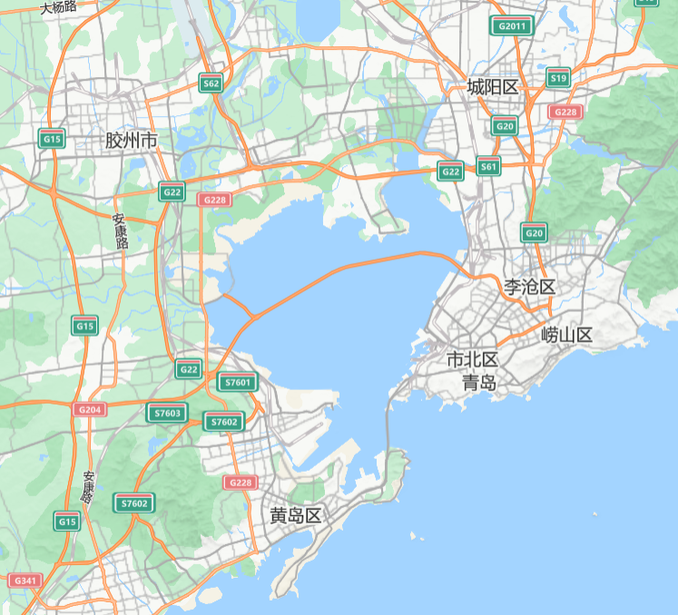

# 青岛旅游攻略
本文档聚焦青岛文旅中**本人推荐的景点&美食**，和**文旅相关的背景和架构**
## 一、特点概述
1. **自然风景**：
    - 大海，绿树，礁石，草茂，沙滩
2. **建筑风格**：
    - 青岛保留了大量具有德式特色的建筑，形成了独特的城市风貌。红瓦绿树是青岛的标志性景象，地铁站的墨绿色设计也与城市的自然和人文景观完美融合。
3. **美食**：
    - 青岛美食以**胶东菜**为代表，结合了鲁菜和海鲜的特色。**青岛啤酒**是当地的名片，世界闻名，与**海鲜烧烤**更是绝配。此外，**烧烤野馄饨、戳子肉**等是青岛排挡类型的特色。因为离韩国近（去韩国机票比本人回家机票便宜）**韩式料理**较多，也有做的不错的还有各种基于海鲜的小吃，如**海鲜水饺、海鲜馄饨、海鲜锅贴**等。
## 二、住宿推荐
### 要谈住宿推荐首先谈青岛的地理结构：  
青岛是一个很分散的城市，机场在胶州市（县级市），可以坐地铁到市区（市南区、市北区算是市区），主要的旅游景点也都在市南区市北区。推荐住在**市南区、市北区**的**离地铁站近**的民宿or酒店。在主要的旅游景区之间通勤推荐地铁和网约车，**青岛的出租车比较坑**。
  
## 三、美食架构Tsingtao Foods Backbone（笑）
1. **胶东菜**：
    **船歌和双合院**是价格中等的青岛特色餐馆，因为是连锁的缘故开的很多，但是味道根据是商场半成品店还是现做店水平差距较大，且不去实际店铺难以分辨店铺类型。个人觉得船歌比双和园贵一点点但是出品更好，从抄答案的角度来看可以去**黄岛珠江路店**（因为我去过，离**金沙滩**（黄岛区，离市区远，但是沙滩在青岛算不错的，没怎么去过海边可以去）不太远，需要打一点点车应该）。点菜推荐：**全家福饺子**（各种海鲜馅都有）、**胡萝卜饺子**（我吃过的最好吃的胡萝卜饺子，个人觉得这个东西做不好吃，但是船歌居然做的很不错，很惊艳，当然两个人吃不完还是推荐优先点全家福水饺，体验各种口味特色），还有特色就是**海肠捞饭和大虾烧白菜**（根据个人财力酌情点菜233333现做店出品都还过得去），至于其他菜可以现场点单看看或者点美团。  
    **如何分辨船歌的半成品店**：当然如果没计划来黄岛，在市区可以随便找一家船歌，如果门口没有新鲜海鲜展示的话就是商场半成品店，点个全家福饺子，随便吃点菜就行，商场店饺子味道没有下滑。  
    **开海**是更高端的店子，网上普遍评价出品更好更稳定，但是我没吃过，你想去的话可以美团看看价格，b站看看攻略。
2. **海鲜**：
    海鲜加工是沿海城市共有的特色，但是青岛的缺点是：著名市场营口路拉客很严重，旅游体验不佳，团岛农贸市场拉客情况好一些，但是我没有知道的好吃的加工店，而且青岛海鲜加工也不便宜（输烟台），同样的钱不如去吃船歌、开海。
3. **啤酒**：
    体验青岛啤酒文化最dio的就是青岛啤酒博物馆，无敌推荐，顶级体验，非周末，对剧本杀感兴趣可以买剧游票，一边玩剧本杀一遍参观。普通票也很好。现场可以喝到最新鲜的原浆啤酒，麦香和发酵的味道很不错。挖球的原浆冰激凌贵，但是顶级，很顶级。  
    但是啤酒博物馆门口的饭店很坑，别去。
4. **烧烤**：
    青岛烧烤...感觉不如淄博，主要是喝点啤酒很凉快很舒服
5. **野馄饨**：
    传统野馄饨感觉不如海鲜馄饨，野馄饨店和海鲜馄饨店很多卖微波炉烤串，也是青岛特色，味道也一般，哪家有小搞几串试试味得了
6. **戳子肉**：
    戳子肉：买东西去加工，可以买gala，五花肉，鸡翅，鸡腿，豆制品等去加工，种类别买太多，按类收加工费貌似。我知道的可以的店子**戳子肉（北方市场店）**，但是很火，去的话一定要在类似于工作日17点这种时候去，不然排队排死
7. **韩式料理**：
    韩式料理我吃过**全州烤肉**还行，但不是非去不可的类型，其他的店子可能需要自己发掘一下。
8. **海鲜小吃**：
    **这部分很有特色**  
    **海鲜馄饨**: **咕噜馄饨**吃别的路过的店子，出品出乎意料的不错，很多创新馅料的馄饨，可以一人要两种口味让老板拼一下，推荐虾滑馄饨，贝柱馄饨，皮蛋馄饨（看着黑暗实际很好吃），脂渣馄饨（也很有特色，口感不错，很有意思的创意）  
    **海鲜水饺**: **船歌**就行  
    **海鲜锅贴**: **一品鲜鱼锅贴** 很鲜很香脆的海鲜锅贴，和咕噜馄饨很近，可以买了带到馄饨店吃或者路上吃，5个一买，个头不算太小  

## 四、个人向绝赞景点推荐（见pdf，只说重点）